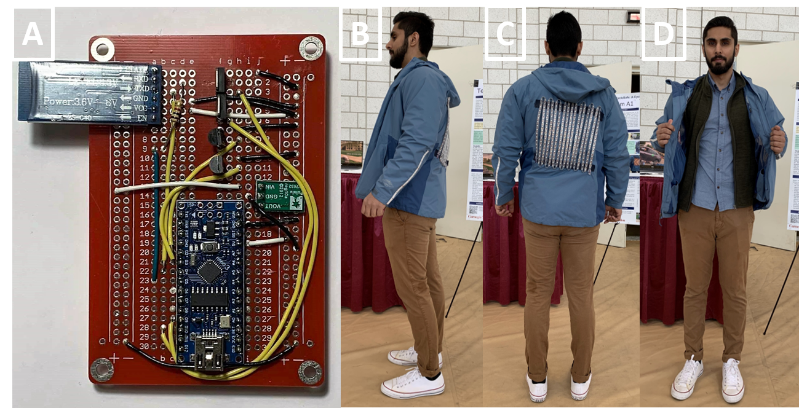

# CycleSafe

A safety-system integrated onto you and your bike to keep you safe on the road.

Consists of a smart jacket that is bluetooth integrated with a bike mount.

# Bike

Bike view from car

Bike visibility

## Jacket

Chip inside the jacket

Turn Signals

Buzzer in the jacket to notify the rider

## Directory Structure

- `paper`: source code for the paper
- `src`: contains all the code for the project, including

  - `arduino`: modules for the arduino, for sensor and peripheral integration
  - `android`: phone app, uses Google Map data and customizes jacket display
  - `raspberry`: code for the Raspberry Pi controller, safety sensor integration and control center for all operations